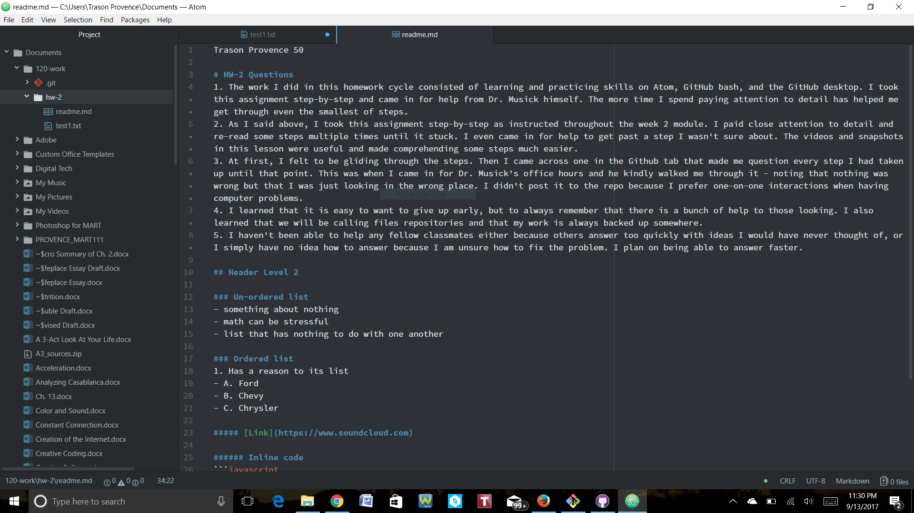

Trason Provence 50

# HW-2 Questions
1. The work I did in this homework cycle consisted of learning and practicing skills on Atom, GitHub bash, and the GitHub desktop. I took this assignment step-by-step and came in for help from Dr. Musick himself. The more time I spend paying attention to detail has helped me get through even the smallest of steps.
2. As I said above, I took this assignment step-by-step as instructed throughout the week 2 module. I paid close attention to detail and re-read some steps multiple times until it stuck. I even came in for help to get past a step I wasn't sure about. The videos and snapshots in this lesson were useful and made comprehending some steps much easier.
3. At first, I felt to be gliding through the steps. Then I came across one in the Github tab that made me question every step I had taken up until that point. This was when I came in for Dr. Musick's office hours and he kindly walked me through it - noting that nothing was wrong but that I was just looking in the wrong place. I didn't post it to the repo because I prefer one-on-one interactions when having computer problems.
4. I learned that it is easy to want to give up early, but to always remember that there is a bunch of help to those looking. I also learned that we will be calling files repositories and that my work is always backed up somewhere.
5. I haven't been able to help any fellow classmates either because others answer too quickly with ideas I would have never thought of, or I simply have no idea how to answer because I am unsure how to fix the problem. I plan on being able to answer faster.

## Header Level 2

### Un-ordered list
- something about nothing
- math can be stressful
- list that has nothing to do with one another

### Ordered list
1. Has a reason to its list
- A. Ford
- B. Chevy
- C. Chrysler

##### [Link](https://www.soundcloud.com)

###### Inline code
```javascript
var s = "Javascript syntax highlighting";
alert(s);
```

**bold**
*asterisk*


